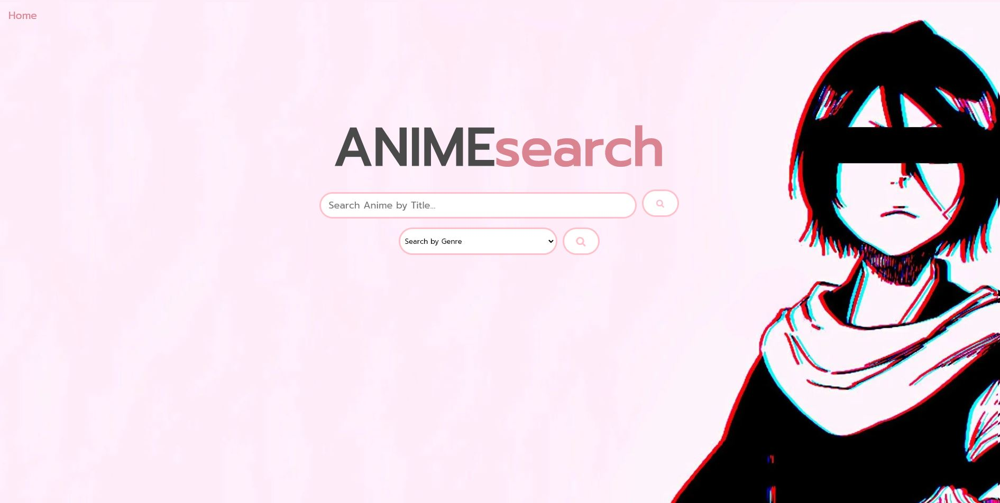

# ANIMEsearch

<H4> In this application, the user will be able to easily search an anime by its title. When they search by the title, it will display six cards with data relevant to this search. The user will have the option to search by genre. When they search by genre, the browser will display ten cards with data relevant to their search. The user will also have the option to watch the trailer for whichever anime is associated with the card. The user will also be able to see their search history and have the option to navigate back to the main screen.

## Technology:
- Kitsu API
- YouTube API
- Bulma CSS library
- Google Fonts
- Font Awesome

## Collaborators:
- Rhoward1
- kellena
- carolynngo11
- nicoled1999

Click [here](https://nicoled1999.github.io/project-1/) to view our website